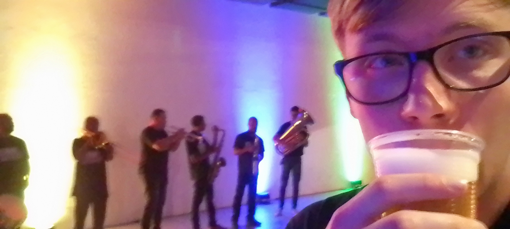
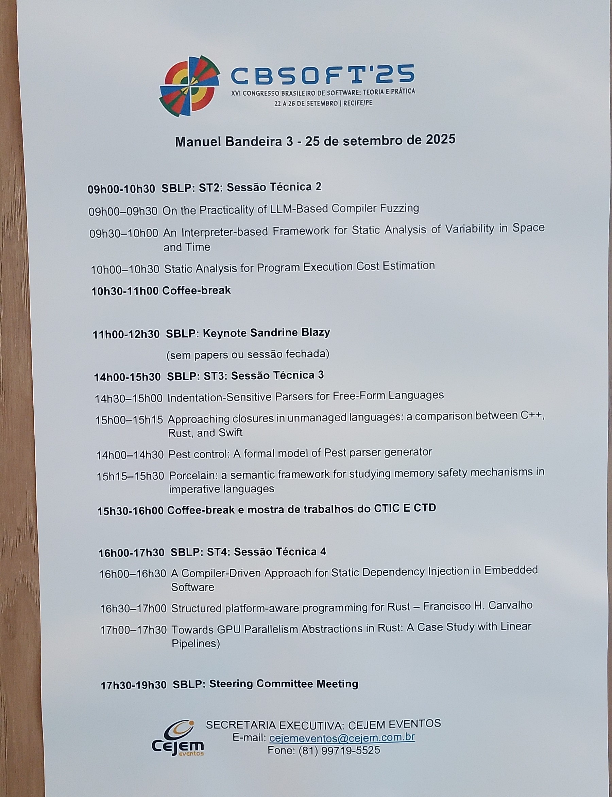
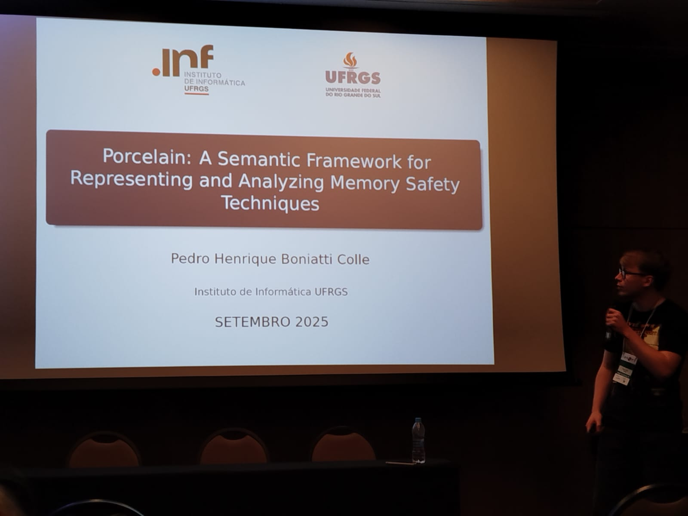
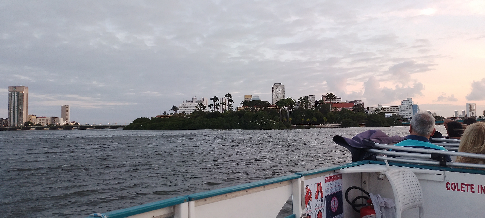

# Porcelain leva um menino pro outro lado do país.

Durante a escrita do TCC, meu orientador recomendou redigir a pesquisa como um _short paper_ para enviá-lo a [CBSoft25](https://cbsoft.sbc.org.br/2025/cbsoft/). Incrementando algumas correrias, que são parte do processo de entrega do TCC, o depenado documento de três páginas foi enviado para avaliação. Expectativas eram relativamente baixas, considerando a carência de experiência; que nada, fui aprovado. Restava apenas se dirigir a Recife, PE, para apresentar o trabalho no CBSoft 25.

---

Na metade do dia 23/09, terça-feira, Porto Alegre já era minúsculo. Conseguimos participar da cerimônia de abertura, que acontecia no centro de Recife. Discursos batidos precederam estatísticas da participação do evento, que precedeu breves apresentações de danças tradicionais da região. Esse por sua vez, antecedeu uma festa de coquetéis, sem cadeiras, em que longas filas impediram o consumo de cervejas.

Pulamos quarta-feira. Quarta-feira foi conferência normal, apresentações legais, pessoas interessantes, coisa de conferência. Comi um acarajé.

Quinta-feira às 15 horas e 15 minutos, foi o meu momento de apresentar.

Nervosismo a parte; e também a palestra da Sandrine Blazy do [compCert](https://compcert.org/), que fez minha pesquisa parecer raquítica, a parte; ocorreu tudo certo. A utilidade do meu sistema foi questionada, dado a Sandrine na plateia, mas consegui esclarecer que eram coisas que operavam em espaços diferentes, o _compCert_ validou C, _Porcelain_ poderia ser usado para validar C nos erros de memória. Eu era peixinho, pequeninho, deu certo.

Sexta-feira turistamos.

## Conclusão

Foi bom sair de casa, foi melhor ainda voltar.

O _short paper_ se encontra publicado no SOL da SBC:
- https://sol.sbc.org.br/index.php/sblp/article/view/36953/36738
A monografia completa está no [lume da UFRGS](https://lume.ufrgs.br/handle/10183/298722).
